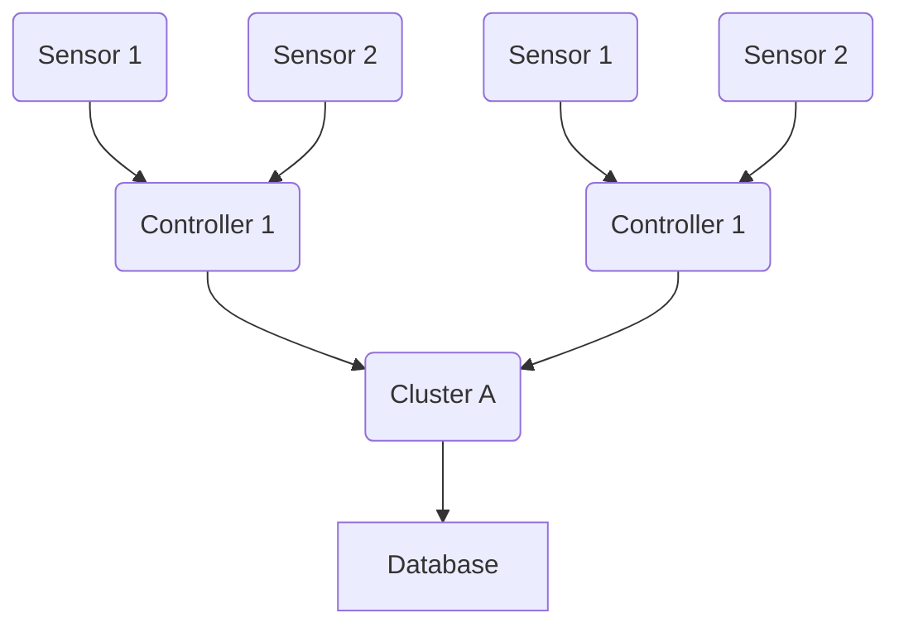
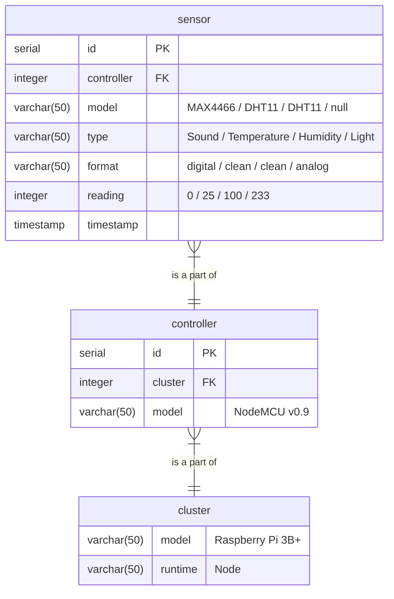

This is a sensor server system using Internet Protocol on a home WiFi.
## Structure

The system is a single top-down network consisting of a cluster of controllers, each with its own set of sensors.

Every controller in this system is a separate IP server. Each one returns JSON data whenever called; this contains raw sensor data at the time of call. The cluster computer dials these controllers one by one (based on a pre-programmed interval) to gather sensor data into cache. Afterwards, it stores the data into the database and empties the cache, ready to store new data.

The reason why I built it like this instead of going straight from controller to database is to have more control over the frequency of writes in the database. Since I plan to host the only current cluster and database in the Raspberry Pi, I wouldn't want my microcontrollers to destroy the Pi's memory card from doing too many writes.

## ERD


There are three types of sensor readings: digital, analog, and clean.

**Digital** and **analog** readings are raw readings from the digital and analog strings. **Clean** readings, however, contain data that have been formatted as part of the sensor module's output / the Arduino driver library's settings. These are typically I2C-based modules, but can also refer to the likes of the DHTx series of humidity and temperature sensors which output in digital but return a numerical value because of the way the driver library "cleans" them up.

Controller and cluster information, meanwhile, are only there to tell the user where the reading came from.

## Schema
**Public schema**
```postgresql
CREATE TABLE cluster (
	id SERIAL PRIMARY KEY,
	runtime varchar(50)
);

CREATE TABLE controller (
	id SERIAL PRIMARY KEY,
	cluster INTEGER REFERENCES cluster(id),
	model varchar(50)
);

CREATE TABLE sensor (
	id SERIAL PRIMARY KEY,
	controller INTEGER REFERENCES controller(id),
	model VARCHAR(50),
	type varchar(50),
	format varchar(50),
	reading INTEGER,
	timestamp TIMESTAMP
);
```

**Initialize current setup**
```postgresql
INSERT INTO cluster (runtime)
	VALUES ('Node');

INSERT INTO controller (cluster, model)
	VALUES (1, 'NodeMCU v0.9 (ESP12)');
```

**Create new sensor reading**
```postgresql
INSERT INTO sensor (
	controller,
	model,
	type,
	format,
	reading
) VALUES (
	1,
	'CdS',
	'photoresistor',
	'analog',
	$1
);
```

**Drop all**
```postgresql
DROP TABLE cluster, controller, sensor;
```

**Get all**
```postgresql
SELECT  
	sensor.model AS sensor, 
	sensor.type, 
	sensor.format, 
	sensor.reading, 
	CONCAT_WS(controller.model, controller.id) AS controller, 
	runtime,
	sensor.timestamp
FROM sensor
	JOIN controller ON controller.id = sensor.controller
	JOIN cluster ON cluster.id = controller.id;
```
## Use in Future Projects
The output of this server can be used in future projects as sample data. I can also use this structure in other swarm-based projects, like that in [[About Swarm Protocol||Project Swarm]].