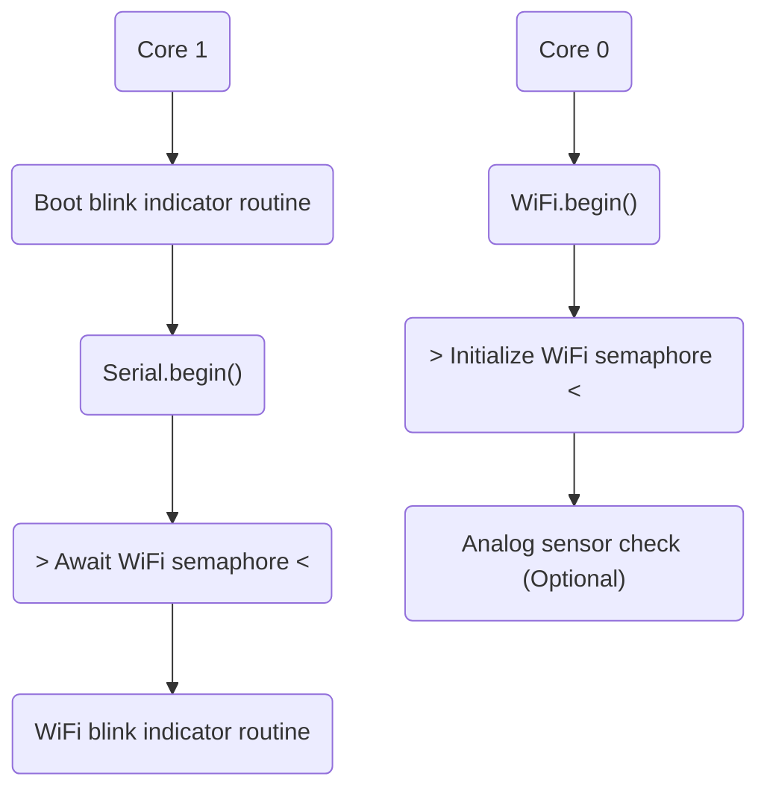

Using the FreeRTOS on the Arduino framework, the main core on the ESP32 is Core 1.

The following shows the boot sequence for each sensor server unit.

```mermaid
graph TD
	c1(Core 1) --> b1(Boot blink indicator routine) --> s1("Serial.begin()") --> aw1(> Await WiFi semaphore <) --> b2(WiFi blink indicator routine)
	c0(Core 0) --> w1("WiFi.begin()") --> sem1(> Initialize WiFi semaphore <) --> as1("Analog sensor check (Optional)")
```
