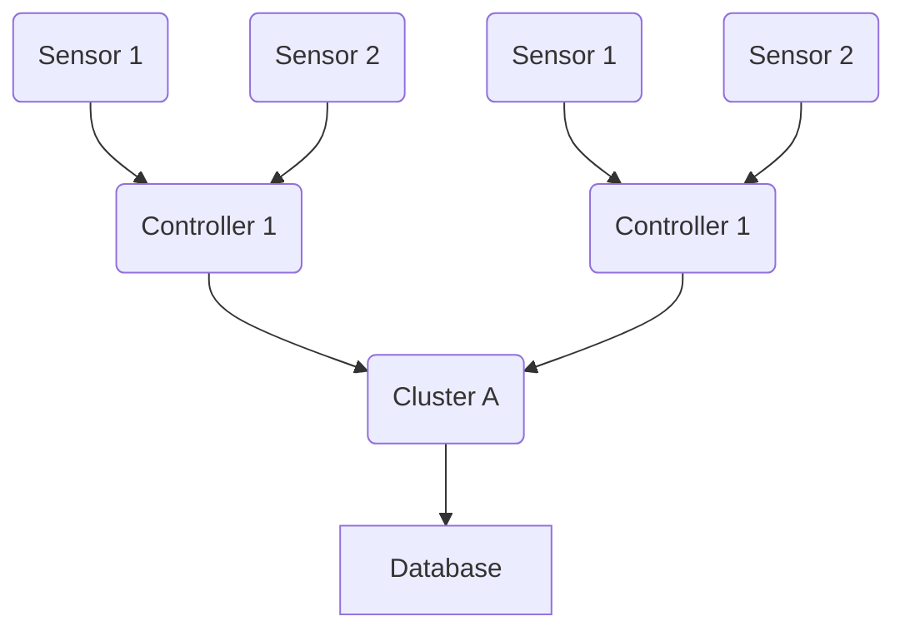

This document contains details on the RTOS version of the sensor server project.

## Overview
The RTOS implementation allows the sensor server to do other tasks while running the server protocol. The current document contains a summary of the [[Pushing the ESP32 to Its Limits - Sensor Server 2||Sensor Server project]] as well as implications for related projects.

## Background
The Sensor Server project is a subproject for my 100 Days of Code on Daedalus. It is meant to be a learning project and a prototype implementation of [[About Swarm Protocol||Project Swarm]].

**Figure 1.** *Sensor server protocol as defined in [[Daedalus - Sensor Server Structure and Environmental Data DB ERD]]*

With an RTOS, each controller within the sensor server architecture can multitask with other tasks, such as keeping tabs on other controllers within their wireless networks and implementing [simple synchronization protocols](https://www.sciencedirect.com/science/article/pii/S2405896317320335) between controllers and clusters.

Since the aim of my 100 Days of Code on Daedalus is to learn as many things related to data science, I opted with FreeRTOS for convenience and compatibility with the Tensilica Xtensa microcontroller architecture within both ESP32 and ESP8266. At the time of writing, I found RIOT as a suitable candidate. However, FreeRTOS seems to have the most literature related to the Arduino framework.

After setting up the sensor server system, I should be ready to move on to other parts of the data pipeline. The current project should immensely help with the data source part of the pipeline.

## Implications for Future Projects
The current project will change many of my previous plans, as well as improve some of my other planned pursuits.

First of all, the current project will change the way that the Swarm Protocol will work. As Swarm was made with a single core in mind, it should remain as such to maintain compatibility with other low-spec devices. On the other hand, thanks to `vTaskDelay()`'s asynchronous nature, the Swarm protocol will intensively use this part of FreeRTOS (and that of other RTOSes, if I ever have to move to them) to juggle between computationally-intensive tasks.

Second, the RTOS will likely be a mainstay technology for all future embedded projects. The convenience of asynchronous delays are more convenient than the traditional `millis()`-based protocols used in the Arduino. Plus, the fact that I can work with the stack size means I can run and kill multiple computationally-intensive tasks at different intervals; I'll just need to make sure that they don't run at the same time. This way, I can work with virtually larger stack sizes by passing around the available stack memory between tasks.

And lastly, the RTOS comes as the next logical step into learning more about embedded systems. Should I ever come to apply to an embedded systems job, I can share them my work with RTOS-based systems that incorporate embedded systems engineering with data science and data engineering.